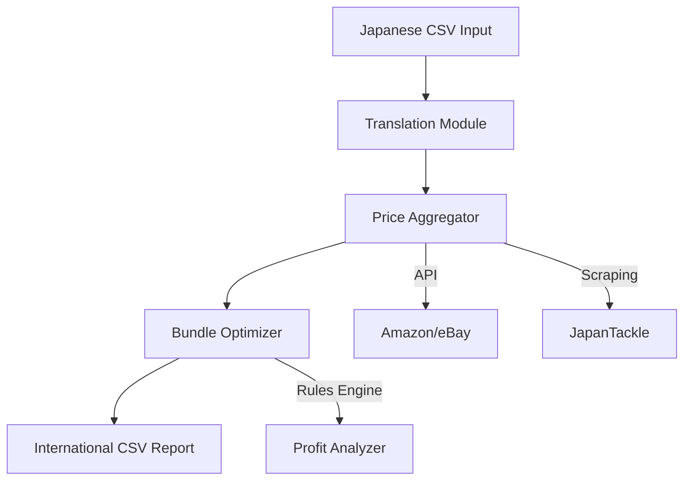

# Fishing Lure International Bundling System (FLIBS)

## System Overview



## Key Features

- Multi-source Price Integration (API + Web Scraping)
- Smart Bundle Allocation Algorithm
- Multi-currency Financial Analysis
- Automated Reporting System

## Implementation Status

| Module      | Progress | Tech Stack          |
| ----------- | -------- | ------------------- |
| Core Engine | 90%      | Python 3.10, Pandas |
| Translation | 60%      | Google Cloud API    |
| Pricing     | 45%      | Scrapy, Requests    |
| API Layer   | 10%      | FastAPI             |
| Web UI      | 0%       | ReactJS             |

## Getting Started

```bash
# Install dependencies
pip install -r requirements.txt

# Run main pipeline
python main.py --input data/product.csv
```

## Documentation

See detailed technical specifications in `docs/` directory
